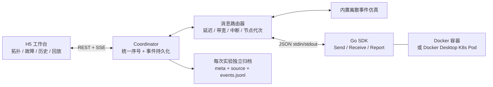

# 运行与事件模型



## 数据流

1. 浏览器提交配置。coordinator 校验节点数、运行环境和网络参数，分配 UUID，持久化配置与源码。
2. 仿真模式创建消息驱动状态机；容器模式构建程序并建立每节点独立 stdin/stdout 会话。
3. SDK 的 `Send` 输出 JSON，coordinator 记录 `send`，根据有向链路的序列化时间、排队时间和延迟调度送达。
4. 仿真模式调用目标状态机并记录 `receive`。Go 模式将数据写入进程 stdin，记录 `deliver`；SDK `Receive` 读取消息时返回确认，coordinator 才记录 `receive`。
5. `Report` 产生完整 `state` 事件。程序 stderr 作为独立日志事件展示。
6. 所有事件先追加写入 JSONL，再经 SSE 推送。SSE 用事件序号作为 ID，支持浏览器重连后的续传。
7. 回放使用事件序号限定可见历史，从起点或已有前缀增量重建节点状态和链路设置，不读取运行中的“最新状态”代替过去。

拓扑和时空图共享 `cursor`（可见事件数）与 `playTime`（回放毫秒）。慢速倍率乘在回放时钟上，切换视图不改变两者。消息详情中的接收/丢弃状态也只检查 `seq <= cursor` 的记录，避免已加载整份历史导致未来信息泄露；即使多个事件时间戳相同，单步仍按序号隔离。

时空图的 X 轴为 coordinator 时间，每个节点独占一条水平行。已接收箭头从发送位置连接到接收位置；未接收消息用虚线连接到接收方行的当前时间，表示待接收，不能把该端点解释为已送达。时间窗口外的图形会裁剪；长延迟、在窗口前发送但仍在途的消息仍会显示。状态/故障标记和箭头均链接至原始事件。

`spaceStart` / `spaceWindow` 控制视野，与 `cursor` / `playTime` 独立。拖动、滚轮、键盘或平移滑块暂停视野跟随；恢复跟随或显式调整回放进度会重新定位播放位置。SVG 根据容器宽度绘制，节点标签固定在左侧，每行高 100px；时间窗最小为 100ms。标签以包围盒检测避免重叠，可悬停或聚焦展开；节点消息筛选、心跳筛选和相同状态去重只作用于视图，不改动原始事件。

## 应用输入

低层节点通过 `DeclareInput` 输出 `input_schema`；RPC 适配层自动从注册的 Go 参数类型 / protobuf descriptor 生成同一声明。运行适配器校验后按节点保存并写入事件日志。内置模型的声明和处理器在 `server/protocols.js`，低层 Go 示例的声明在 `examples/node/main.go`；coordinator 和前端没有按协议名分派输入的逻辑。

前端按当前节点最新声明生成表单，草稿按实验和节点保存，提交 `{node, action, values}`。这是实时控制接口，回放时仍显示当前可用声明；回放的节点状态、消息和输入事件标记只读取可见事件前缀。服务端拒绝未声明动作、未知字段和类型/范围错误，随后先记录 `command` 再投递至模型的 `command(cmd)` 或真实节点的 `Commands` channel。投递同步失败记录 `command_error`；节点处理结果通过协议自身 `Report` 表示。

SDK `cmd.Values` 是 `json.RawMessage`，支持嵌套 JSON，`cmd.ID` 为 `input-<command事件序号>`。应用输入是节点本地外部输入，不经过节点间故障链路；由输入引起的 `Send` 消息照常受网络故障约束。

RPC 适配层独占节点消息/输入通道，将 peer request/response/cancel 包装为可观察消息并通过 coordinator 路由。net/rpc 使用标准 Server 和 ClientCodec / ServerCodec，wire 内容是 gob；gRPC unary 使用 protobuf wire，接收端通过本地 bufconn 调用实际 gRPC server。两者与节点间原生 TCP/HTTP2 链路不同。消息同时附带可读 JSON，关联 `rpcId`；应用返回生成 `command_result`。当前不支持 gRPC stream。

## 目录协议项目

`server/library.js` 从 `DISTVIS_PROTOCOL_DIR`、已保存设置或默认 `protocols/` 扫描直接子目录的 Go module。Go 文件头的可选 `distvis:name`、`distvis:description` 和 `distvis:entry` 注释定义名称、说明及入口；入口可自动发现。`server/metadata.js` 在目录和编辑器中统一解析，兼容旧 `distvis.json`。这些说明不声明 RPC 输入字段。每次创建实验重新解析项目，归档源码文件及 SHA-256。

Pod 把原始根目录挂载到 `/protocols`，把本次不可变快照挂载到 `/protocol`，两者均只读。`compile` init container 在临时副本中编译到共享 `/app/node`；主容器从 `/protocol` 工作目录运行该二进制，持久状态位于 `/state`。Docker 用独立编译容器执行同一脚本。项目的 Go module 可以正常使用第三方依赖；编译副本将 `distvis` replacement 指向镜像内 SDK，不修改用户目录。

## 网络语义

对于方向 `A → B`，消息字节数为 `size`：

```text
wireStart = max(sendTime, previousWireEnd[A,B])
wireEnd   = wireStart + ceil(size / (bandwidthKiBps * 1024) * 1000)
deliverAt = wireEnd + latencyMs
```

已经入队消息保留发送时计算的延迟/带宽计划；后续改变延迟或带宽影响新消息。链路中断及节点崩溃在送达时再次检查。崩溃/恢复改变节点代次，使崩溃前尚在传输的消息失效。

`blocked` 链路上的新消息立即产生 `drop`；消息不会无限缓存直到链路恢复。节点持久状态由协议自行管理。

发送与状态消息中的时间均为 coordinator 观察时间，不宣称是分布式节点同步时钟，也不推断没有被记录的因果关系。每个事件的 `seq` 保证相同时间戳时仍有全序。

## 事件示例

```json
{
  "seq": 27,
  "time": 1481,
  "timestamp": "2026-09-18T01:00:01.481Z",
  "type": "send",
  "id": "a5bfa6c3-7",
  "from": "node-1",
  "to": "node-2",
  "payload": { "type": "RequestVote", "term": 1 },
  "bytes": 31,
  "delay": 81
}
```

`time` 为实验经过毫秒，内置仿真使用虚拟时钟；Go 模式按单调实时时钟推进。`timestamp` 从实验创建时间加 `time` 得到，真实节点的本地时钟不参与排序。容器构建阶段不推进实验时钟。

消息内容与节点状态不绑定特定协议字段；`role` 是可选显示约定。自定义状态完整展示为 JSON。

## HTTP 接口

| 方法 | 路径 | 用途 |
| --- | --- | --- |
| GET | `/api/protocols` | 示例说明 |
| GET / POST | `/api/library` | 扫描目录协议 / 保存协议根目录 |
| GET | `/api/example` | 内置 Go 示例源码 |
| GET / POST | `/api/runs` | 实验历史 / 创建实验 |
| GET | `/api/runs/:id` | 配置、状态与完整事件 |
| GET | `/api/runs/:id/events?after=N` | SSE 增量事件；支持 `Last-Event-ID` |
| POST | `/api/runs/:id/faults` | `crash` / `recover` / `link` / `heal` |
| POST | `/api/runs/:id/commands` | 通用应用输入 `{node,action,values}`；兼容旧 `{node,key,value}` |
| POST | `/api/runs/:id/stop` | 结束运行与回收资源 |
| GET | `/api/runs/:id/source` | 本次归档源码 |
| GET | `/api/runs/:id/export` | 配置、源码与事件的 JSON 导出 |

同一 coordinator 同时运行一个实验；历史可以任意查看。历史重放不占运行名额。更改已结束实验的故障请求被拒绝。

## 可扩展位置

- `server/engine.js`：协议无关的传输和实验控制。
- `server/protocols.js`：内置协议状态机、输入声明和处理器。
- `server/inputs.js`：通用输入 schema 和字段值校验。
- `server/library.js`：目录协议发现、源码快照和 K8s 主机路径映射。
- `sdk/rpc/`：标准 RPC 接入、字段推导、请求关联及超时处理。
- `sdk/node.go`：学生代码的协议无关接口。
- `server/runtime.js`：Docker/K8s 进程与资源管理。
- `server/index.js`：归档、API、SSE。
- `public/app.js`：事件还原、节点渲染、回放时钟和交互。

后续可独立增加：远程项目上传、gRPC 流式通信、课程/班级隔离、自动故障脚本、应用不变量检查、完整 Raft 日志复制、Lamport 时序图、Maelstrom 检查器接入、Chaos Mesh 真网络适配。
