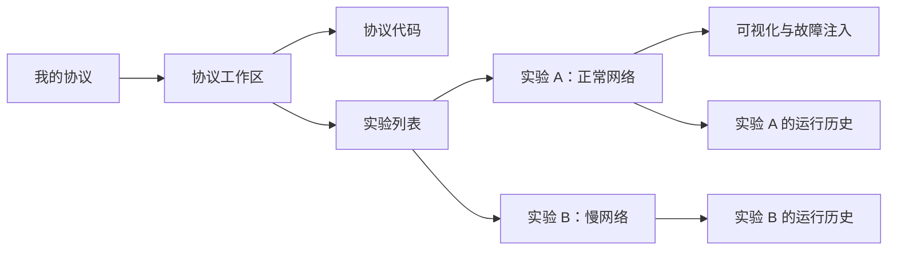

# 协议与实验的两层工作区

用户先打开协议，再选择实验。Go 程序属于协议；参数、执行过程和历史属于实验。运行是实验下的一次不可变记录。

| 层级 | 保存内容 | 页面 |
|---|---|---|
| 协议 | Go 项目、构建入口、代码版本、来源 | 协议代码 / 实验列表 |
| 实验 | 所属协议、节点数量、环境、延迟、带宽、种子 | 可视化 / 运行历史 |
| 一次运行 | 执行时代码快照与版本、实际参数、消息、输入、故障 | 实时观察 / 历史回放 |

协议编辑器不再重复选择协议。新建实验只保存配置，点击运行才启动节点；「仅保存配置」允许先准备实验。实验中的「查看协议代码」与顶部面包屑返回同一个协议工作区。协议代码保存后供所有下属实验的后续运行使用；不同协议独立。未保存草稿会保留，运行前需保存代码。

每个实验的历史按 experimentId 隔离，运行时关联 protocolId 和 protocolRevision。旧运行快照不随代码保存变化；查看历史代码只读，复制到当前协议草稿需显式操作。协议保存与实验配置保存均检查版本冲突。

旧工作区迁移保留实验 ID、参数和历史，仅同来源且代码、构建入口相同的项目合并为一个协议。不同代码各自保留。旧浏览器实验草稿分别恢复为独立协议，保留原缓存，避免覆盖共享代码。

验证包含 API 的共享代码、独立配置、历史隔离、不可变快照、版本冲突及迁移；Chrome 真实 Docker 验收创建两个实验并运行三次，通过 RPC 返回值确认节点确实执行修改后的 Go 程序，同时检查故障隔离、草稿刷新恢复和手机布局。脚本：`tests/browser-hierarchy-smoke.mjs`，结果：`artifacts/protocol-hierarchy-docker.json`。

归档协议集中放在库页折叠区，侧栏和主列表只显示正常协议。实验归档区位于所属协议页；归档可恢复。一次性去重只执行经核对的协议映射，并验证完整代码一致，保留旧链接及下属实验。验收脚本明确标记创建请求，避免继续污染用户的协议和历史列表。

界面采用紧凑布局：协议与实验卡片只显示名称和关键数量/参数；移除装饰性标语、重复标题与说明。教学示例、归档、事件日志、运行详情、时空图筛选、文件操作和高级构建设置默认折叠，归档操作放入「更多」。运行统计合并为一行，编辑器和拓扑高度适应窗口，主要回放和保存操作在桌面首屏可见。侧栏可收起并记住选择；手机文件列表改为横向切换。用户展开的历史配置和节点原始状态不会因定时刷新收起。

可视化页面进一步让出空间：侧栏收起为临时导航抽屉（☰ 打开，不改变其他页面记住的侧栏偏好）；实验标题只在面包屑中显示一次，「协议代码 / 可视化 / 运行历史」并入顶栏。图上方只保留一条运行控制条：左侧是随运行状态变化的主按钮（运行实验 / 启动中… / 结束实验 / 重新运行 / 前往运行中的实验）和状态，中间是回放控制与时间轴，右侧是精简统计、「网络」（恢复全部链路与最近故障）和「运行详情」。拓扑随容器大小重新布局，12 个节点放不下时在图区内部滚动。原来分开的「节点详情 / 故障注入」两个标签合并为锚定在节点或连线旁的弹出面板，目标来自点击，不再下拉选择；面板中的操作读取实时状态，状态行标注回放时刻。图例、提示和事件日志说明收进「图例」菜单。验收脚本：`tests/browser-layout-smoke.mjs`。
